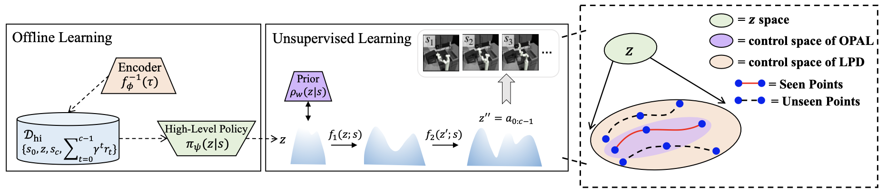

# Offline Hierarchical Reinforcement Learning

This is a jax implementation of LPD on [Datasets for Deep Data-Driven Reinforcement Learning (D4RL)](https://github.com/rail-berkeley/d4rl), the corresponding paper is [Flow to Control: Offline Reinforcement Learning with Lossless Primitive Discovery](file:///Users/yangyiqin/Downloads/26286-Article%20Text-30349-1-2-20230626-2.pdf).



## Quick Start
For experiments on D4RL, our code is implemented based on IQL:

First train the flow model:
```shell
$ python3 flow.py
```

Then, run the following code:
```shell
$ python3 train_offline.py --env_name=antmaze-large-play-v0 --config=configs/antmaze_config.py --eval_episodes=10 --eval_interval=5000
```

## Citing
If you find this open source release useful, please reference in your paper (it is our honor):
```
@inproceedings{yang2023flow,
  title={Flow to control: Offline reinforcement learning with lossless primitive discovery},
  author={Yang, Yiqin and Hu, Hao and Li, Wenzhe and Li, Siyuan and Yang, Jun and Zhao, Qianchuan and Zhang, Chongjie},
  booktitle={Proceedings of the AAAI Conference on Artificial Intelligence},
  volume={37},
  number={9},
  pages={10843--10851},
  year={2023}
}
```

## Note
+ If you have any questions, please contact me: yangyiqi19@mails.tsinghua.edu.cn. 
